# aasvg

Convert ASCII art diagrams into SVG.

This is inspired by [goat](https://github.com/blampe/goat) but rather than a
reimplementation, this code uses the original
[markdeep](https://casual-effects.com/markdeep/) code.

## Usage

Install with `npm install -g aasvg`.

Feed `aasvg` an image and it will write an SVG.  For example:

```
$ aasvg < example.txt > example.svg
```

<!-- generate this with the ~~backdrop option to avoid it looking terrible
     when shown on GitHub in dark mode -->


## Character Placement

By default, this does not place text characters on a grid one-by-one as the
original markdeep code did.

The `--spaces` command-line argument controls how text is combined.  Use either
`--spaces=0` or `--stretch` to provide precise text placement.

`--spaces=0`
ensures that every character is placed separately; which is precise and avoids
text distortion, but makes for a larger SVG that is harder to search.

`--stretch` can be used with `--spaces` set to any value.  `--stretch` stretches
text to fit, which is less widely implemented in viewers (generally you don't
have to worry about this unless you are using an [insane
profile](https://datatracker.ietf.org/doc/html/rfc7996)) and might distort the
text a tiny bit because the metrics for the font used (the generic "monospace")
cannot be exactly controlled.
